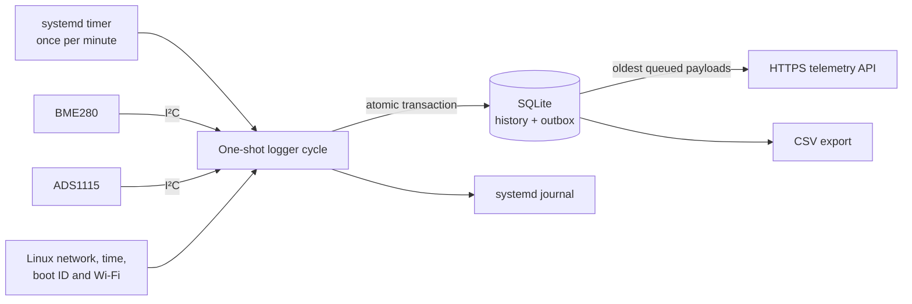

# Garden Logger — Raspberry Pi edition

Garden Logger is a durable, unattended environmental telemetry collector for Raspberry Pi. Once per minute it reads air temperature, humidity, pressure, soil temperature, light, and battery voltage; records the observation locally; and optionally forwards the exact JSON payload to an HTTPS endpoint.

This is a Raspberry Pi OS port of an ESP8266 logger that preserves the `garden.telemetry.v1` wire contract. Its defining reliability rule is **persist first, transmit second**: outages can delay or duplicate delivery, but must not silently discard a locally accepted reading.

> **Status:** Implemented Python logger, package version `1.0.0`, emitting firmware identifier `3.0.0-rpi`. This repository includes the runtime, installer, systemd units, schema, tests, and field-acceptance material. The receiving API is an external dependency.

## Contents

- [Capabilities](#capabilities)
- [Architecture and workflow](#architecture-and-workflow)
- [Hardware and wiring](#hardware-and-wiring)
- [Installation](#installation)
- [Configuration](#configuration)
- [Operations and troubleshooting](#operations-and-troubleshooting)
- [Telemetry contract](#telemetry-contract)
- [Storage and delivery guarantees](#storage-and-delivery-guarantees)
- [Time behavior](#time-behavior)
- [Security](#security)
- [Development and testing](#development-and-testing)
- [Repository map](#repository-map)
- [Constraints and open questions](#constraints-and-open-questions)
- [Evidence and provenance](#evidence-and-provenance)

## Capabilities

| Capability | Outcome | Status |
| --- | --- | --- |
| Environmental sensing | Captures BME280 air data and ADS1115-backed soil temperature, light, and battery readings | Implemented |
| Local history | Retains append-only observations in SQLite, independent of remote connectivity | Implemented |
| Store-and-forward | Queues exact JSON payloads and drains the oldest records first | Implemented |
| Data-quality signaling | Uses `null` fields and status bits for sensor, time, and network conditions | Implemented |
| Trustworthy time | Prefers synchronized UTC, falls back to a same-boot estimate, or records no time | Implemented |
| Field operations | Provides status, CSV export, explicit simulation, calibration, and acceptance guidance | Implemented |
| Remote dashboards/analysis | Supplied by a compatible receiver; not included here | External dependency |
| RTC, rainfall, moisture, irrigation, OTA, digital lux | Potential future capabilities outside telemetry v1 | Deferred |

Primary users are the node installer/operator and downstream telemetry consumers. Useful operating measures include observation continuity, outbox depth and age, invalid-measurement rate, network availability, and battery trend. The repository defines no numerical service-level targets.

## Architecture and workflow



The Python 3.11+ application runs as a fresh, bounded process for each timer activation. It composes adapters for I²C sensors, Linux network state, synchronized time, SQLite, and HTTPS around one deterministic cycle:

1. Load and validate TOML; open SQLite and I²C adapters.
2. Wait up to the configured deadline for the network interface.
3. If online, wait up to the configured deadline for NTP synchronization.
4. Choose synchronized UTC, a same-boot monotonic estimate, or no trusted time.
5. Read sensors, average analog samples, calibrate, and validate ranges.
6. Reserve a per-installation sequence and build an `event_id`.
7. Atomically append immutable history and, when enabled, enqueue the exact payload.
8. If online with usable time, attempt up to `max_uploads` oldest items. Stop on the first failure; remove only after HTTP 2xx.
9. Print a compact JSON result, close resources, and exit.

Default budgets are 12 seconds for network state, 10 seconds for time sync, and 12 seconds per upload. The installed service has `TimeoutStartSec=55`; keep upload limits and timeouts compatible with that outer deadline.

### Design decisions

| Decision | Status | Benefit and consequence |
| --- | --- | --- |
| One-shot systemd activations | Reconstructed | Isolates cycles and releases resources; each run must fit the service timeout |
| Atomic history + outbox commit | Historical/implemented | Makes local acceptance independent of network delivery; queued data consumes disk |
| Preserve original JSON | Historical/implemented | Prevents later releases reinterpreting queued readings; duplicates normalized and raw data |
| At-least-once delivery | Historical/implemented | Survives uncertain acknowledgments; receiver must deduplicate `event_id` |
| Trust only synchronized/derived time | Historical/implemented | Avoids false timestamps; time may be `null` without an RTC |
| Explicit simulation only | Implemented | Prevents hardware failures silently producing plausible fake readings |

## Hardware and wiring

The documented target is a Raspberry Pi 4 Model B with 64-bit Raspberry Pi OS Bookworm. Linux/Blinka I²C also makes a Pi 3 B+ a plausible target, but field acceptance must be repeated on every board, storage device, enclosure, and power supply.

```sh
tr -d '\0' </proc/device-tree/model; echo
```

Expected hardware:

- BME280 at `0x77` or `0x76`, forced mode.
- ADS1115 at `0x48`, gain 1, 128 samples/second.
- Ten single-ended samples averaged per analog channel by default.
- 3.3 V sensor logic; ADS1115 inputs must not exceed its 3.3 V supply.

Power down before wiring and enable I²C with `sudo raspi-config nonint do_i2c 0`.

| Physical pin | Signal | Connection |
| ---: | --- | --- |
| 1 | 3.3 V | BME280 VIN and ADS1115 VDD |
| 3 | GPIO2 / SDA1 | BME280 SDA and ADS1115 SDA |
| 5 | GPIO3 / SCL1 | BME280 SCL and ADS1115 SCL |
| 9 | Ground | All sensor grounds |
| ADS1115 A0 | Analog | Light output |
| ADS1115 A1 | Analog | Thermistor-divider midpoint |
| ADS1115 A2 | Analog | Battery-divider midpoint |

```text
light_pct = clamp(corrected_A0 / 3.3 × 100, 0, 100)
3.3 V → 10 kΩ fixed → A1 → 10 kΩ NTC → ground
battery source → 100 kΩ → A2 → 100 kΩ → ground
battery_v = corrected_A2 × 2
```

The telemetry battery range is 0–5 V. Do not monitor a nominal 5.1 V Pi USB-C rail without revising the circuit and schema. Keep a case fan separate from the 3.3 V sensor rail. Older Pi 2/3 Eleduino cases do not align with Pi 4 ports, and these cases are not weatherproof; use a ventilated weather-rated outer cabinet, glands, and drip loops.

## Installation

Prerequisites are Raspberry Pi OS, Python 3.11+, root access, working I²C, and network access if uploading.

```sh
sudo raspi-config nonint do_i2c 0
sudo ./scripts/install.sh
sudoedit /etc/garden-logger/config.toml
sudoedit /etc/garden-logger/secrets.env
sudo systemctl enable --now garden-logger.timer
```

The installer adds `python3-venv`, `python3-pip`, and `i2c-tools`; copies the app to `/opt/garden-logger`; creates its virtual environment and a non-login `garden-logger` user; creates configuration under `/etc/garden-logger`; and installs the service/timer. Persistent state is under `/var/lib/garden-logger`. Existing config and secret files are preserved on reinstall, but application files under `/opt/garden-logger` are recopied. There is no rollback workflow.

## Configuration

Start with [`config/garden-logger.example.toml`](config/garden-logger.example.toml), then validate it:

```sh
sudo -u garden-logger /opt/garden-logger/.venv/bin/garden-logger \
  --config /etc/garden-logger/config.toml validate-config
```

| Key | Example/default | Purpose |
| --- | --- | --- |
| `device.id` | `garden-node-01` | 1–64 letters, digits, `.`, `_`, or `-` |
| `storage.database_path` | `/var/lib/garden-logger/garden.db` | SQLite state/history/outbox |
| `cycle.interval_seconds` | `60` | Time-estimation interval; does not schedule systemd |
| `cycle.network_timeout_seconds` | `12` | Interface wait deadline |
| `cycle.time_sync_timeout_seconds` | `10` | NTP synchronization deadline |
| `cycle.http_timeout_seconds` | `12` | Hard deadline per upload worker |
| `cycle.max_uploads` | `10` | Maximum oldest items attempted per cycle |
| `network.interface` | `wlan0` | Interface for carrier and RSSI |
| `telemetry.enabled` | `false` | Enqueue new data and attempt uploads |
| `telemetry.api_url` | HTTPS example | Must be HTTPS when enabled |
| `hardware.bme_addresses` | `0x77`, `0x76` | Ordered BME280 probe addresses |
| `hardware.ads1115_address` | `0x48` | ADS1115 I²C address |
| `hardware.*_channel` | `0`, `1`, `2` | Distinct channels 0–3 |
| `hardware.analog_samples` | `10` | Samples averaged per channel |
| `calibration.*` | Circuit defaults | Positive circuit constants and meter scales |

Store the credential in `/etc/garden-logger/secrets.env` with mode `0600`:

```dotenv
GARDEN_LOGGER_API_BEARER_TOKEN=replace-me
```

This variable overrides a TOML bearer token. Keep secrets out of TOML and Git. Enable telemetry only after local readings work.

> `cycle.interval_seconds` and systemd's `OnUnitActiveSec` are separate. If changing cadence, update the timer unit too, reinstall it, and run `sudo systemctl daemon-reload`.

## Operations and troubleshooting

```sh
i2cdetect -y 1  # expect 48 and 76 or 77
sudo systemctl start garden-logger.service
journalctl -u garden-logger.service -n 50 --no-pager
systemctl list-timers garden-logger.timer

sudo -u garden-logger /opt/garden-logger/.venv/bin/garden-logger \
  --config /etc/garden-logger/config.toml cycle --simulate
sudo -u garden-logger /opt/garden-logger/.venv/bin/garden-logger \
  --config /etc/garden-logger/config.toml status
sudo -u garden-logger /opt/garden-logger/.venv/bin/garden-logger \
  --config /etc/garden-logger/config.toml export-csv --output /tmp/datalog.csv
```

`cycle` reports `event_id`, sequence, status bits, pending count, and uploaded count. `status` reports database path, counts, and the latest event. Put `--verbose` before the subcommand for debug logging.

| Symptom | Check | Behavior |
| --- | --- | --- |
| Exit code 1 | Journal, `validate-config`, storage permissions, I²C access | Configuration/composition/storage errors stop safely |
| Sensor fields `null` | I²C detection, power, ground, addresses, channels, voltage | Failed fields remain explicit; simulation is not automatic |
| `observed_at` is `null` | `timedatectl show -p NTPSynchronized --value` | Record is stored with `ERR_TIME` and waits in outbox |
| Pending count grows | Interface, DNS, TLS, API response/token | Oldest item retries; first failure blocks newer uploads that cycle |
| Wrong cadence | `systemctl cat garden-logger.timer` | systemd, not TOML, schedules runs |
| 55-second timeout | Configured waits and upload count | Termination may leave a sequence gap |

Complete [`docs/field-acceptance.md`](docs/field-acceptance.md) before deployment and record meter corrections in [`docs/calibration-log.md`](docs/calibration-log.md). Acceptance includes abrupt power removal, duplicate delivery, bounded failures, and a 24-hour offline soak on real hardware.

## Telemetry contract

[`schema/telemetry-v1.schema.json`](schema/telemetry-v1.schema.json) is normative; [`examples/reading.example.json`](examples/reading.example.json) is valid. Uploads are `POST` requests with JSON content, JSON acceptance, and an optional bearer header.

```json
{
  "schema": "garden.telemetry.v1",
  "event_id": "garden-node-01-4a17c2e1-42",
  "device_id": "garden-node-01",
  "sequence_number": 42,
  "observed_at": "2026-08-27T01:30:00Z",
  "measurements": {
    "air_temp_f": 78.44,
    "humidity_pct": 61.25,
    "pressure_hpa": 1009.31,
    "soil_temp_f": 72.18,
    "light_pct": 44.7,
    "battery_v": 3.982
  },
  "wifi_rssi": -67,
  "status_bits": 0,
  "firmware_version": "3.0.0-rpi"
}
```

Temperatures are -40–185 °F, humidity/light 0–100%, pressure 300–1100 hPa, battery 0–5 V, and RSSI -127–0 dBm. Measurements and RSSI may be `null`; `observed_at` is UTC ending in `Z` or `null`. Non-finite values become JSON `null`, never `NaN`. CSV uses `NaN` for missing measurements and blanks for time/RSSI.

### Status bits

| Hex | Meaning |
| ---: | --- |
| `0x0001` | BME280 unavailable/read invalid |
| `0x0002` | Soil input/conversion failed |
| `0x0004` | Light input/conversion failed |
| `0x0008` | Battery input/conversion failed |
| `0x0010` | ADS1115 unavailable |
| `0x0020` | No trustworthy timestamp |
| `0x0040` | Storage error reserved by v1; current code exits before emitting it |
| `0x0080` | Network interface deadline expired |
| `0x0100` | Timestamp estimated from same-boot anchor |

The receiver must validate the schema, durably upsert on `event_id`, return 2xx for accepted duplicates, assign `received_at`, and return non-2xx when it did not durably accept a record. Cross-device order is not guaranteed. Sequence numbers are diagnostic and restart if installation state is lost.

## Storage and delivery guarantees

SQLite enables foreign keys, a five-second busy timeout, WAL, and `synchronous=FULL`.

| Table | Role and invariant |
| --- | --- |
| `state` | Installation ID, last sequence, and trusted time anchor |
| `observations` | Permanent normalized history plus exact payload; triggers reject updates/deletes |
| `outbox` | FIFO pending data; identity/payload/queue time immutable; failures retain count/error |
| `delivery_receipts` | Successful response code and acknowledgment time |

History and outbox are committed together before transmission. A 2xx stores a receipt and deletes only the outbox row. Delivery is **at least once**: a crash after reserving identity can leave a sequence gap, while a crash after server acceptance but before local acknowledgment can duplicate an upload. Receivers must deduplicate by `event_id`. There is no retention, compaction, backup, or database-size policy.

## Time behavior

Wall time is trusted only when `timedatectl` reports `NTPSynchronized=yes` and the epoch is at least 2024-01-01 UTC. If synchronization is lost during the same boot, the logger advances the last trusted time by the greater of configured interval or monotonic elapsed time and sets `0x0100`. After reboot it rejects that anchor. Without trusted time it stores `observed_at: null`, sets `0x0020`, and does not drain uploads.

Use an OS-integrated, UTC-configured DS3231 when offline timestamps must survive power loss; direct RTC support is not implemented.

## Security

Observed controls include mandatory HTTPS when enabled, hostname/CA verification through Python's default TLS context, environment-file credential support, and a dedicated non-login service account. The systemd unit uses `NoNewPrivileges`, `PrivateTmp`, strict system/home/kernel/control-group protections, `UMask=0027`, and an explicit `/var/lib/garden-logger` write path.

Repository evidence does **not** establish receiver authorization, credential rotation, encrypted local storage/backups, firewall policy, log-redaction guarantees, dependency scanning, audit retention, or regulatory compliance. Review the API and operating environment against actual security and privacy requirements.

## Development and testing

```sh
python -m venv .venv
. .venv/bin/activate
python -m pip install -e '.[test]'
pytest
```

On PowerShell, activate with `.\.venv\Scripts\Activate.ps1`. Hardware-independent tests cover schema validity, calibration/ranges, configuration and HTTPS enforcement, persistence-before-upload, immutable history, exact-payload recovery, retry/acknowledgment, time fallback, and CSV missing values.

Tests show intended behavior under controlled conditions, not real-device power-loss safety or receiver idempotency. No CI/CD pipeline is present; release and deployment are manual.

## Repository map

```text
src/garden_logger/
├── cli.py          CLI composition and lifecycle
├── cycle.py        ordered observation workflow
├── sensors.py      hardware adapters and calibration
├── timekeeper.py   trusted UTC and fallback
├── network.py      interface and RSSI
├── models.py       wire-format construction
├── storage.py      SQLite history/outbox/CSV
├── transport.py    bounded HTTPS and FIFO drain
├── config.py       TOML/environment validation
└── constants.py    schema, firmware, status bits
schema/             telemetry JSON Schema
examples/           valid payload example
config/             deployable TOML example
deploy/             systemd units and secret example
scripts/install.sh  Raspberry Pi OS installer
tests/              pytest suite
docs/               porting contract and field records
```

There are no Node.js components; the empty `package-lock.json` contains no dependency graph.

## Constraints and open questions

- Receiver implementation, authentication, deduplication proof, availability, and retention are external.
- Local history grows indefinitely; capacity monitoring, archival, restore, and disaster recovery are absent.
- The timer is non-persistent, so powered-off activations are not replayed.
- Detailed sensor failure causes are swallowed into status bits rather than logged.
- There is no backoff or dead-letter queue; a permanent oldest-item failure blocks newer uploads.
- TOML and systemd interval settings can drift.
- Installation has no rollback, release pinning, hash enforcement, or automated migration.
- Metrics, alerts, dashboards, CI/CD, license metadata, and upgrade policy are not present.

## Evidence and provenance

| Topic | Class | Confidence | Sources |
| --- | --- | --- | --- |
| Local-first bounded cycle | Observed | High | `cycle.py`, `cli.py` |
| Sensors/calibration | Observed | High | `sensors.py`, example config, tests |
| Immutable history/outbox | Observed | High | `storage.py`, `transport.py`, tests |
| Trusted time fallback | Observed | High | `timekeeper.py`, tests |
| Payload fields/limits | Observed | High | JSON Schema, `models.py` |
| Isolation/scheduling | Observed | High | systemd service/timer |
| Port rationale | Historical | High | `docs/PORTING.md` |
| Pi 3 B+ portability | Derived | Medium | Linux/Blinka I²C boundary; not hardware-tested here |

---

Generated from branch `main`, commit `548e7344d590991c64962f8f5ffb188b7ba9b396`.

Documentation status: **Generated**

Last generated: **2026-09-05T18:34:12-05:00**
